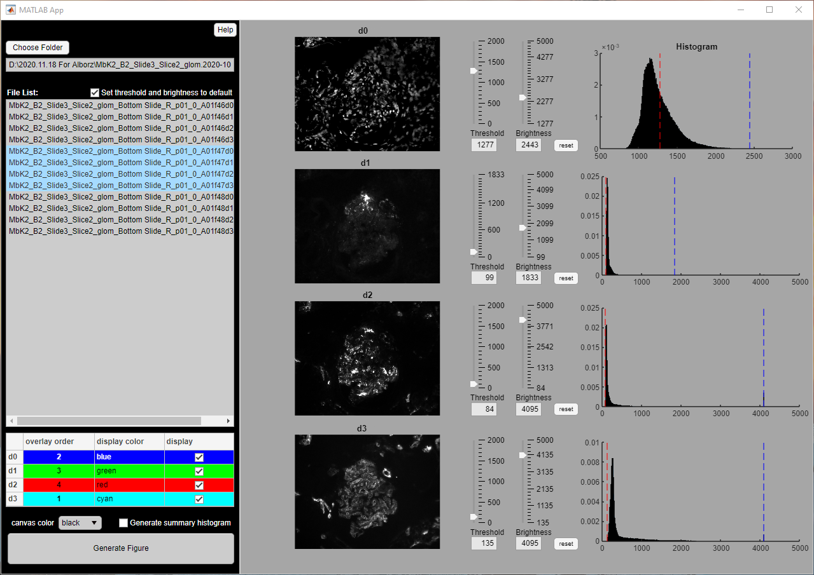
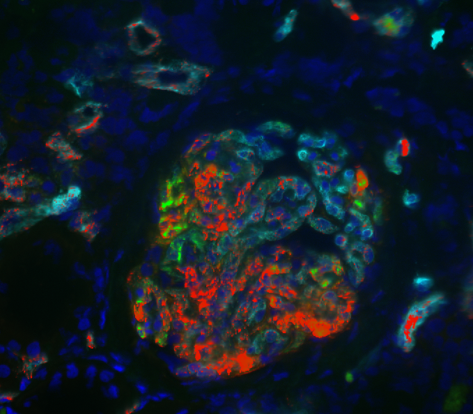

# Multi-channel figure generator
This MATLAB app takes microscope images as d0, d1, d2, d3... and overlays them with color customization. 

* **MultiChannelFigureGenerator.mlapp** requires MATLAB 2020b+ 
* **InstallMCFG_web.exe** does not require a MATLAB license

feature list
- [x] make images larger
- [x] option for NOT automatically updating min and max
- [x] individual reset buttons
- [x] make sure parameters reflect imageJ
- [x] when set default box unchecked, the min/max stay the same but the images don't reflect it
- [x] ability to change colors
- [x] fix the order of files displayed
- [x] choose the order of superposition
- [ ] generate CSV file saving all the parameters, esp threshold
